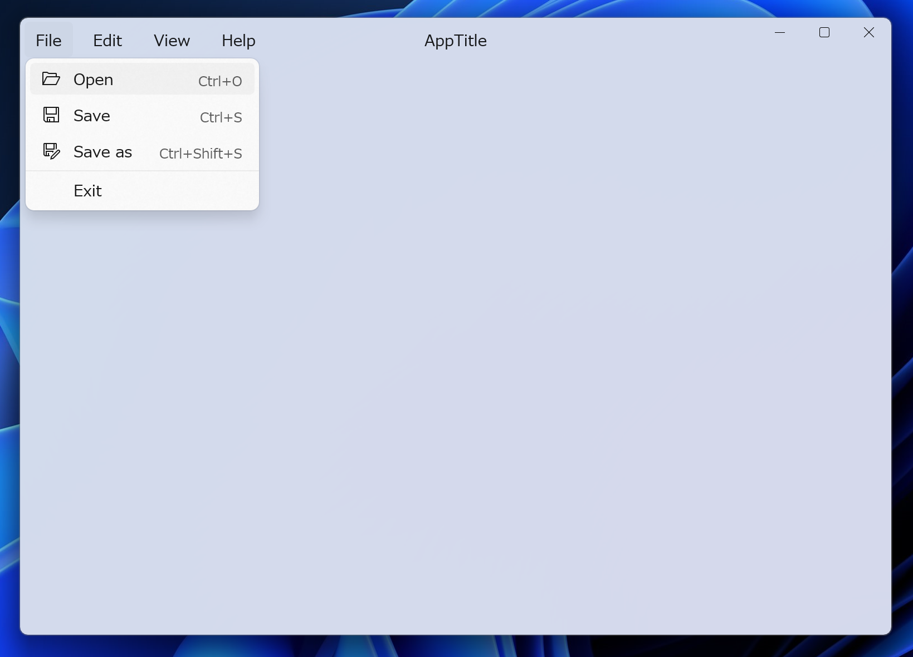

# WinUIExample
This repository is an example of a small WinUI app.

This project can be developed using a combination of dotnet commands and visual studio code, or using visual studio.

## Development command

### dotnet run

Runs source code without any explicit compile or launch commands.

### dotnet build

Builds a project and all of its dependencies.

### dotnet publish

Publishes the application and its dependencies to a folder.

The command execution will output to `bin\x64\Debug\net7.0-windows10.0.19041.0`, and the application can be run by clicking on the executable file.

