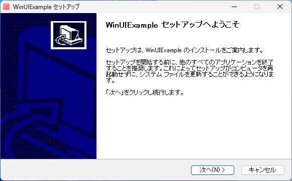

# WinUIExample
日本語 | [English](README.en.md) 

WinUI3 アプリの例とインストーラーを作成する例です。


## プロジェクト名の変更
プロジェクト名が MyApp の場合、

```
.\setup --name MyApp
```

とします。

## 開発
`.\dev.ps1` にコマンドをまとめています。

### アプリの実行
```ps1
.\dev run
```

### インストーラーの作成
インストーラー `install.exe` を作成します

```ps1
.\dev pack
```

Install.exe を実行すると、インストーラーが起動します。
コントロールパネルまたは設定からアンインストールができます。



### アプリの発行
```ps1
.\dev publish
```

### アプリを ZIP ファイルにまとめる
```ps1
.\dev zip
```

### インストール

> [!NOTE]
> レジストリには登録されないため、コントロールパネルまたは設定からアンインストールができません。

```ps1
.\dev install
```

## アンインストール

```ps1
.\dev uninstall
```