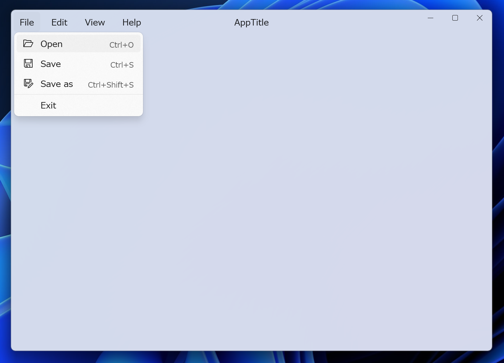

# WinUIExample
WinUI3 アプリの例とインストーラーを作成する例です。



## 開発
`./dev.ps1` にコマンドをまとめています。

### アプリの実行
```ps1
./dev run
```

### インストーラーの作成
インストーラー `install.exe` を作成します

```ps1
./dev pack
```

Install.exe を実行すると、インストーラーが起動します。
コントロールパネルまたは設定からアンインストールができます。


### アプリの発行
```ps1
./dev publish
```

### アプリを ZIP ファイルにまとめる
```ps1
./dev zip
```

### インストール

> [!NOTE]
> レジストリには登録されないため、コントロールパネルまたは設定からアンインストールができません。

```ps1
./dev install
```

## アンインストール

```ps1
./dev uninstall
```